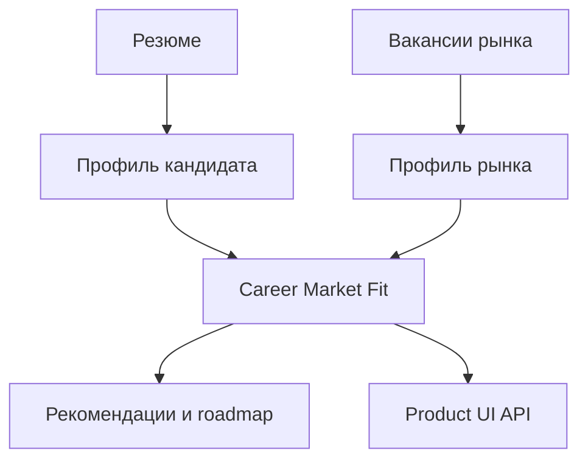

# DevJobs

> Платформа Career Intelligence для анализа резюме, соответствия кандидата рынку и поиска точек роста.

**Текущий статус: backend MVP готов и проверен.** Следующий этап — пользовательский frontend поверх стабильных продуктовых API-контрактов.

## Зачем нужен DevJobs

Поиск работы обычно сводится к просмотру отдельных вакансий. DevJobs превращает вакансии в структурированный сигнал рынка: какие навыки востребованы, где профиль кандидата уже силён, что мешает откликам и какие действия дадут наибольший эффект.

Центральный результат продукта — **Career Market Fit**: объяснимая оценка соответствия кандидата выбранному сегменту рынка.

```text
Резюме → Профиль кандидата → Анализ вакансий → Career Market Fit
      → Рекомендации → План развития
```

## Возможности backend MVP

- Анализ резюме и создание структурированного профиля кандидата.
- Сбор и нормализация вакансий как источника рыночных требований.
- Расчёт Career Market Fit: сильные стороны, пробелы, потенциал и действия.
- Рекомендации релевантных вакансий и анализ причин совпадения.
- Market-Fit Resume и адаптация резюме под выбранную вакансию.
- Асинхронный анализ рынка с отслеживанием статуса выполнения.
- Интеграция с HH через OAuth: импорт резюме и обновление рыночных данных.
- Screen-level API для будущего frontend: dashboard, market fit, vacancies, roadmap, settings и integrations.

## Как устроен продукт



Транспортный слой API остаётся тонким: бизнес-правила находятся в use-case и сервисных слоях, доступ к данным отделён репозиториями, тяжёлые операции выполняются асинхронными worker-задачами.

Подробнее:

- [Архитектура backend](docs/architecture.md)
- [Публичный обзор API](docs/api-overview.md)
- [Качество и проверка работоспособности](docs/quality.md)
- [Статус и развитие продукта](docs/roadmap.md)

## Технологии

Python · FastAPI · PostgreSQL · SQLAlchemy · Alembic · Redis · Celery · Docker · Pytest · Ruff · MyPy · GitHub Actions

## Подтверждение работоспособности

Для release-кандидата backend прошёл:

- 505 автоматических тестов;
- статическую проверку Ruff;
- проверку типов MyPy;
- проверку runtime OpenAPI-схемы;
- архитектурные проверки импортов, thin routers и политики работы с датами;
- CI в GitHub Actions;
- локальный demo-сценарий: seed данных и проверка экранных API dashboard, market fit и vacancies.

## Границы публичного репозитория

Этот репозиторий представляет **продукт DevJobs**, его сценарии и технический уровень реализации. Исходный код, инфраструктурная конфигурация, секреты и рабочие данные остаются в приватном репозитории.

Техническая демонстрация backend и разбор архитектурных решений доступны по запросу.
