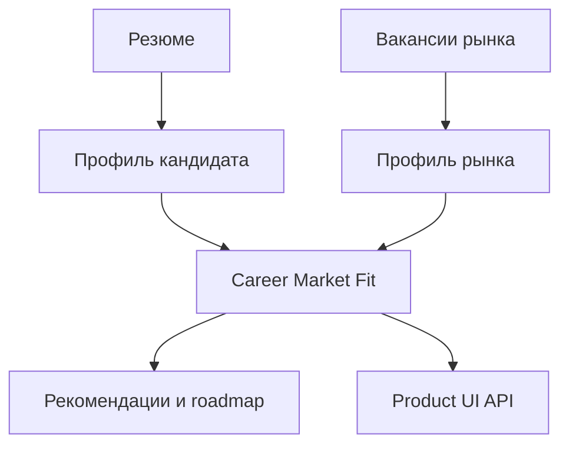

# DevJobs

> Backend-платформа для анализа резюме, рынка вакансий и карьерного соответствия кандидата.

**Статус: backend MVP готов и проверен.** Следующий этап — пользовательский frontend поверх стабильных product API-контрактов.

## Бизнес-задача

Кандидат видит множество отдельных вакансий, но редко понимает рынок целиком: какие навыки востребованы, насколько его профиль соответствует целевой роли и с чего начать развитие.

DevJobs превращает резюме и вакансии в объяснимую картину:

    Резюме → Профиль кандидата → Анализ вакансий → Career Market Fit
          → Рекомендации → План развития

**Career Market Fit** — центральный результат продукта: оценка соответствия кандидата выбранному сегменту рынка, его сильные стороны, дефициты навыков и конкретные действия.

## Для кого

- специалисты, которым нужен ориентир для перехода в новую роль или уровня;
- карьерные консультанты, работающие с резюме и требованиями рынка;
- будущие frontend-команды, которым нужен стабильный backend-контракт для продуктового интерфейса.

## Реализованные возможности backend MVP

- Загрузка и анализ резюме, создание и подтверждение профиля кандидата.
- Сбор и нормализация вакансий как источника рыночных требований.
- Расчёт Career Market Fit: strengths, skill gaps, potential и действия.
- Рекомендации релевантных вакансий с объяснением совпадения.
- Market-Fit Resume и адаптация резюме под выбранную вакансию.
- Асинхронный анализ рынка с отображением статуса и результата.
- Интеграция с HH через OAuth: импорт резюме и обновление данных.
- Screen-level API для будущего frontend: Dashboard, Market Fit, Vacancies, Roadmap, Settings и Integrations.
- Воспроизводимый demo dataset без внешних AI- и HH-ключей.

## Пользовательский сценарий

1. Пользователь загружает резюме или импортирует его из HH.
2. Backend создаёт профиль кандидата; пользователь подтверждает роль, уровень и предпочтения.
3. Пользователь запускает анализ рынка.
4. Worker собирает и обрабатывает вакансии без блокировки HTTP-запроса.
5. Интерфейс получает готовые данные dashboard, Market Fit, вакансий и roadmap.
6. Пользователь видит сильные стороны, пробелы, рекомендации и ближайшее действие.

## Как устроен продукт

Транспортный слой API остаётся тонким: бизнес-правила находятся в use-case и сервисных слоях, доступ к данным отделён репозиториями, тяжёлые операции выполняются асинхронными worker-задачами.

## Технологии

Python · FastAPI · PostgreSQL · async SQLAlchemy · Alembic · Redis · Celery · Docker Compose · Pytest · Ruff · MyPy · GitHub Actions

## Подтверждение работоспособности

Для текущего backend release-кандидата подтверждены:

- **505 автоматических тестов**;
- Ruff и MyPy;
- runtime OpenAPI check;
- проверки import boundaries, thin routers и datetime policy;
- CI, Docker smoke и локальный demo-сценарий;
- миграции, demo seed и screen-level API: Dashboard, Market Fit и Vacancies.

Полная расшифровка: [качество и evidence](docs/quality.md).

## Мой вклад

Я спроектировал и реализовал DevJobs как backend-продукт:

- спроектировал слоистую архитектуру и границы между API, use cases, доменной логикой, репозиториями и инфраструктурой;
- реализовал API и основные продуктовые сценарии;
- смоделировал данные кандидата, вакансий и результата рыночного анализа;
- организовал асинхронную обработку анализа рынка;
- реализовал интеграционный контур HH OAuth и импорта резюме;
- добавил тесты, Docker Compose, CI и автоматические архитектурные проверки;
- подготовил воспроизводимый demo dataset для безопасной демонстрации.

## Публичные материалы

- [Архитектура backend](docs/architecture.md)
- [Публичный обзор API](docs/api-overview.md)
- [Качество и проверки](docs/quality.md)
- [Ограничения MVP](docs/limitations.md)
- [Статус и развитие](docs/roadmap.md)
- [Сценарий записи демо](docs/demo-recording.md)

## Границы публичного репозитория

Этот репозиторий представляет продукт DevJobs, его сценарии и технический уровень реализации. Исходный код, инфраструктурная конфигурация, секреты, рабочие резюме и персональные данные остаются в приватном репозитории.

Техническая демонстрация backend и разбор архитектурных решений доступны по запросу через [GitHub-профиль автора](https://github.com/HageGyakutai).
